# shell脚本结合zabbix玩转故障自愈  
> 收到zabbix故障报警,匹配相应的规则触发不同的自愈机制.当然这个脚本功能不仅仅如此.

[TOC]

## 脚本作用
- 利用zabbix实现故障自愈
- http监控自愈
- tcp端口监控自愈
- 微信/邮件消息通知
- 多方式远程批量执行
- ......

## 实现逻辑(Zabbix故障自愈)
```flow
zabbix_server=>start: zabbix服务端触发告警脚本
self_recover=>operation: zabbix服务端告警(自愈脚本)
analysis_alert_content=>operation: 分析告警内容以及参数
match_rule=>condition: 判断是否满足自愈规则
exit_action=>end: 退出操作
rule_cmd_run=>operation: 根据规则配置执行自愈操作
check_result=>condition: 根据规则配置校验自愈结果(是否成功)
run_cmd_fail=>end: 退出并触发微信和邮件报警
rule_center=>subroutine: 规则配置库
zabbix_server->self_recover->analysis_alert_content->rule_center->match_rule
match_rule(no)->exit_action
match_rule(yes)->rule_cmd_run->check_result
check_result(no)->run_cmd_fail
```

## 脚本内容
```
[root@blueking policeRecover]# tree -L 1
.
├── common.config		#全局配置文件
├── policeRecover.sh    #核心执行脚本
├── rule.config         #规则配置文件  
└── temp                #临时存储文件 
1 directory, 3 files
```

## 使用示例

### zabbix添加告警自愈脚本和相应参数
#### 1. Actions设置
> 对Actions进行特殊设置,Default subject / Default message ,消息内容是规则判断的主要依据。

图1
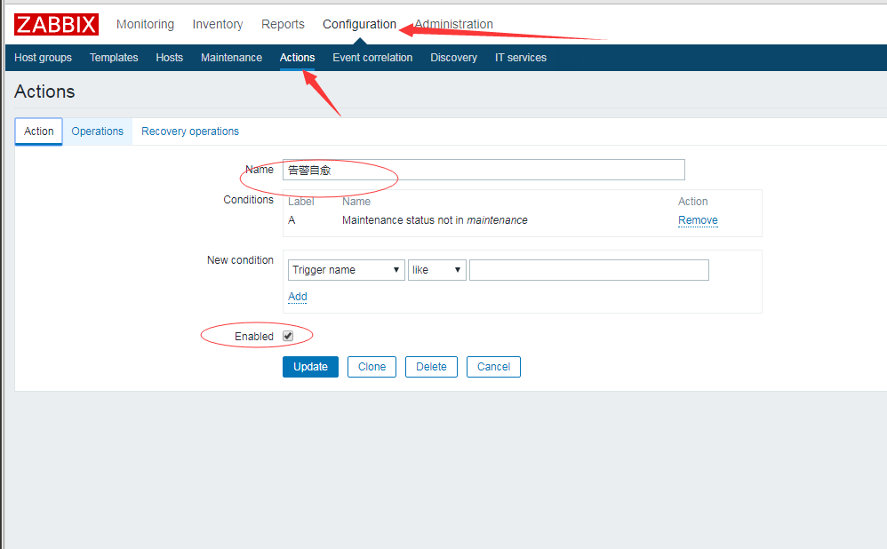
图2
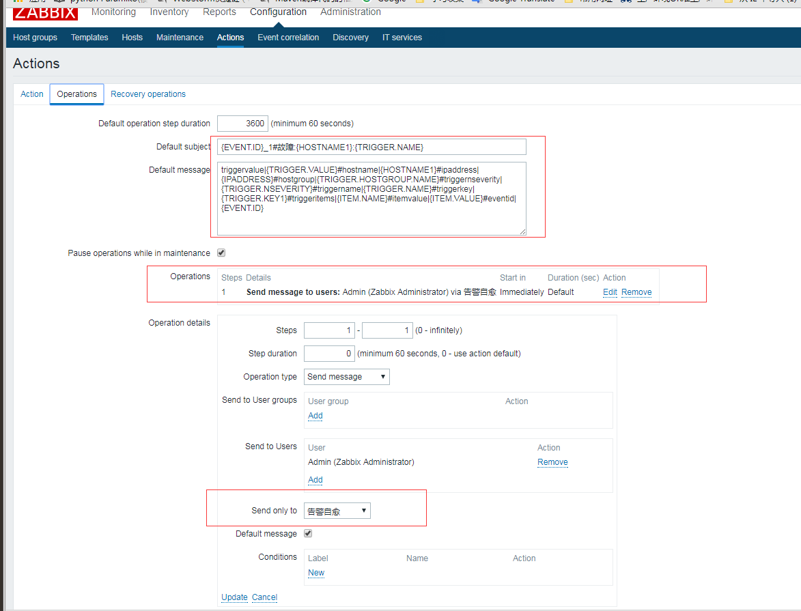
图3
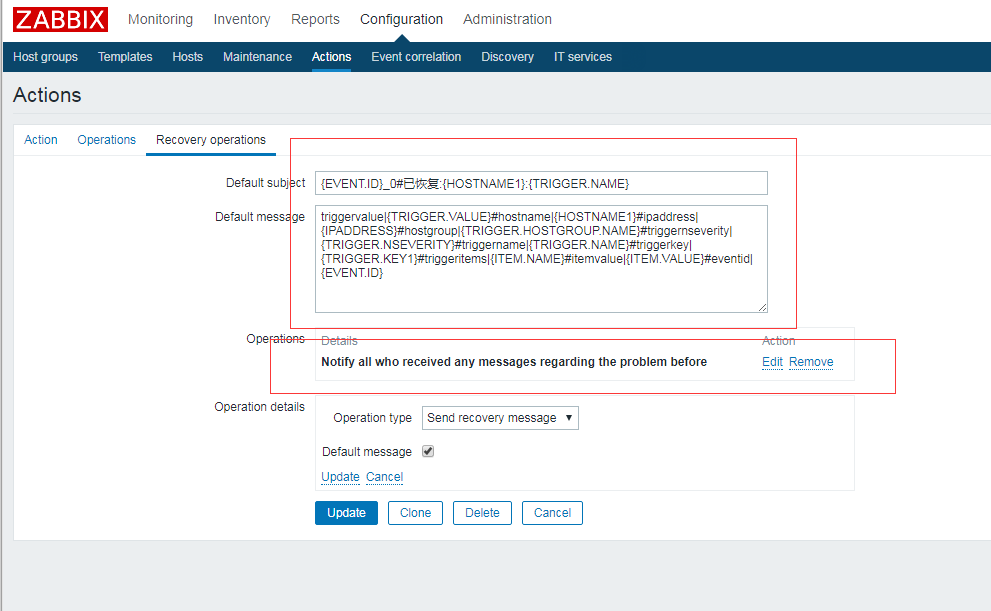

- Default subject
```
{EVENT.ID}_1#故障:{HOSTNAME1}:{TRIGGER.NAME}
```
- Default message
```
triggervalue|{TRIGGER.VALUE}#hostname|{HOSTNAME1}#ipaddress|{IPADDRESS}#hostgroup|{TRIGGER.HOSTGROUP.NAME}#triggernseverity|{TRIGGER.NSEVERITY}#triggername|{TRIGGER.NAME}#triggerkey|{TRIGGER.KEY1}#triggeritems|{ITEM.NAME}#itemvalue|{ITEM.VALUE}#eventid|{EVENT.ID}
```

Recovery operations
- Default subject
```
{EVENT.ID}_0#已恢复:{HOSTNAME1}:{TRIGGER.NAME}
```
- Default message
```
triggervalue|{TRIGGER.VALUE}#hostname|{HOSTNAME1}#ipaddress|{IPADDRESS}#hostgroup|{TRIGGER.HOSTGROUP.NAME}#triggernseverity|{TRIGGER.NSEVERITY}#triggername|{TRIGGER.NAME}#triggerkey|{TRIGGER.KEY1}#triggeritems|{ITEM.NAME}#itemvalue|{ITEM.VALUE}#eventid|{EVENT.ID}
```

#### 2. Media types设置
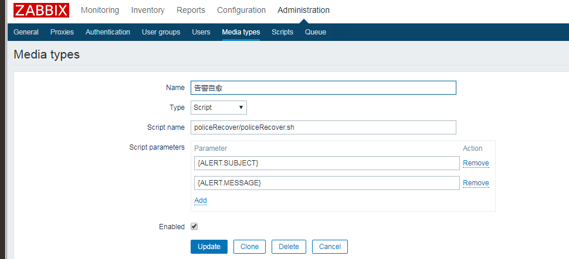

#### 3. Users 设置
> Users需要关联该报警自愈的媒介
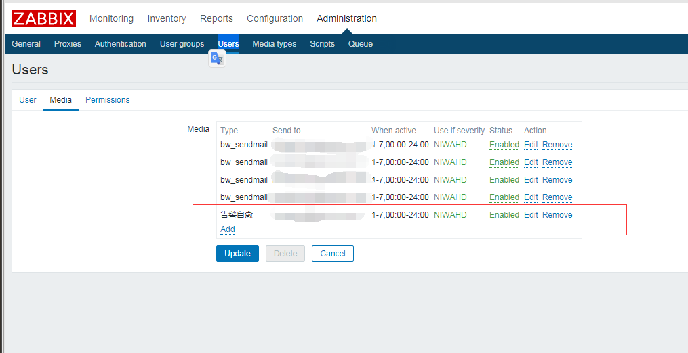

#### 4. 上传脚本
> 将policeRecover上传到Zabbix服务器的alertscripts目录,并修改为可执行权限

```
[root@localhost policeRecover]# ls   
common.config  policeRecover.sh  rule.config  temp
```

### 磁盘空间不足,匹配规则配置后自动恢复
#### 1. 配置磁盘空间不足自愈规则(rule.config)

```
serial:2||env:dev||isactive:1||triggervalue:{=,1}||ipaddress:{like,192.168.3%}||triggername:{like,Free disk space is less than%}||triggerkey:{=,vfs.fs.size[/var,pfree]}||itemvalue:{lt,20}||cmd:echo '' && echo 删除前/var大小&& du -sh /var && find  /var/log/logcenter/ -type f -mtime +10 -exec rm -f  {} \\; &&  echo 10天前的文件删除成功 && echo 删除后/var大小&& du -sh /var||ischeck:1||returncode:0||returnreqiure:{like,%成功%}||returntimeout:60||runlevel:5
```
#### 2. 自愈
1. 模拟触发报警
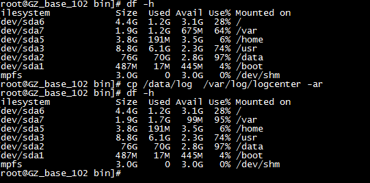

2. zabbix收到报警


3. 触发自愈规则
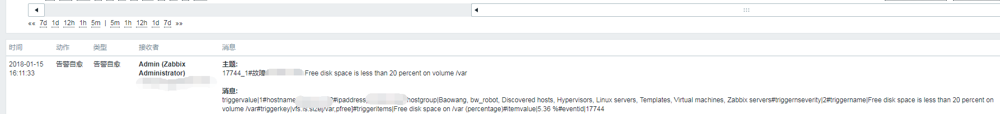

4. 成功或失败发送微信或邮件消息

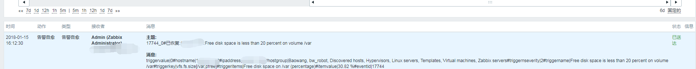

### 应用端口不存在时,匹配规则配置后自动恢复
#### 1. 配置端口不存在自愈规则(rule.config)
```
serial:1||env:dev||isactive:1||triggervalue:{=,1}||ipaddress:{=,192.168.3.85}||triggername:{like,8080 service is down on%}||triggerkey:{=,net.tcp.port[,8080]||itemvalue:{=,0}||cmd:/bin/bash /usr/local/tomcat/bin/startup.sh  ||ischeck:1||returncode:200||returnreqiure:{like,%started%}||returntimeout:60||runlevel:1
```
#### 2. 自愈
1. 模拟端口不存在
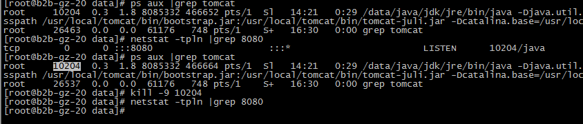

2.触发报警和规则


3.自愈成功
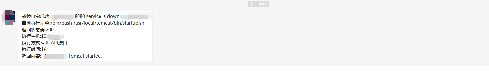

4.失败的情况
> 比如如果你的cmd配置错误
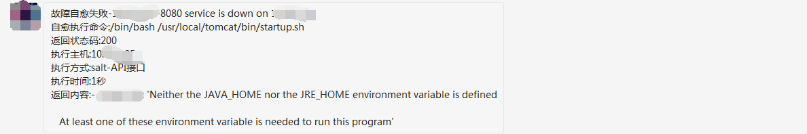

### 接口返回异常时,匹配规则配置后自动恢复
#### 1. 配置web监控(具体细节自行谷歌)
> 监控url,校验返回码和require
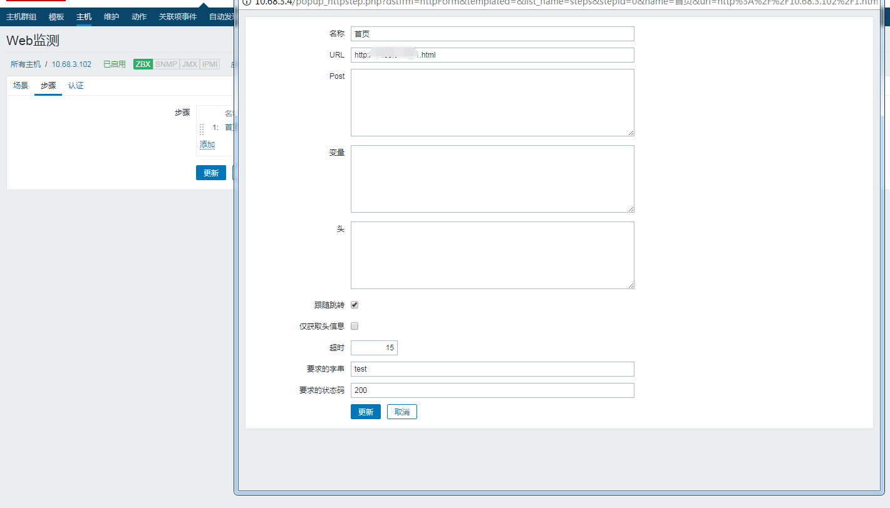

#### 2. 设置接口自愈规则
```
serial:3||env:dev||isactive:1||triggervalue:{=,1}||ipaddress:{=,192.168.3.102}||triggername:{like,首页200监控%}||triggerkey:{=,web.test.rspcode[3.102首页,首页]||itemvalue:{=,404}||cmd:/etc/init.d/nginx restart||ischeck:1||returncode:200||returnreqiure:{like,%success%}||returntimeout:60
```
#### 3. 模拟网页404
访问前
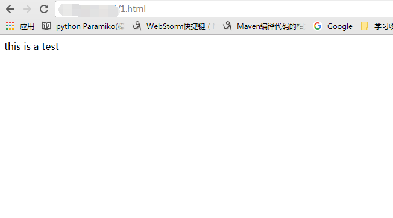
模拟故障后
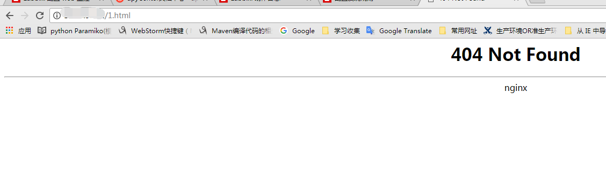

#### 4. 触发报警和规则


#### 5. 自愈
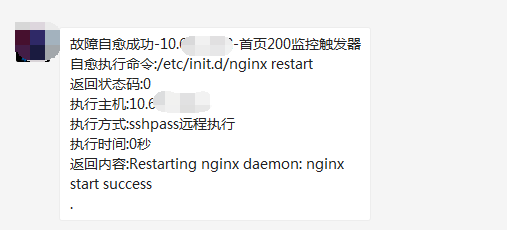

### 自定义规则,执行相应的恢复操作
> 其他自定义规则,可以根据相应的返回KEY，做相应的自愈操作。`一切你想要自愈的操作都可以做到。`
> 需要注意如果是salt-api/ansible等远程执行传参数的时候，如果传特殊符号需要转义，ansible也不支持管道等符号

## 功能说明
### 配置文件
#### 全局配置文件:common.config
```bash
#!/bin/bash
#基础配置文件
#1.0 规则配置相关
#skipRuleParams:规则配置中跳过校验的字段

#2.0 微信消息相关
#CropID:微信企业号CropID,后台可查
#Secret:微信企业号Secret,后台可查
#AppID:企业号中的应用id
#PartyID:企业号中的部门id,多个部门用‘|’分隔
#isSendAll:0(只发送给个人) 1(发送给部门所有人)
#sendUsers:部门成员id(微信号) 当isSendAll为0时发送给${sendUsers},多个用户用空格间隔

#3.0 发送邮件相关(telnet发送无需安装mutt等组件)
#smtp:邮件发送主机
#smtpDomain:邮件发送后缀域名,比如test@abc.com,则配置为abc.com
#from:邮件发送者
#usernameBase64:邮件用户名base64
#passwordBase64:邮件密码base64
#toEmail:发送给谁,多个收件人用空格间隔

#4.0 不同环境下的基础配置项
#*Conf为不同环境下的配置项目,规则配置中将会用到
#devConf开发环境配置
#testConf测试环境配置
#zzbConf准生产环境配置(预生产环境)
#comConf生产环境配置

#4.1 自愈远程执行方式一: 自定义api远程执行
#api:自定义api sync:是否同步(true或false默认异步) async:是否异步(true或false默认异步)  
#rex_env:执行环境(默认local,即本地环境)  auth_type:认证类型(可选:password,key,config)  、
#user:用户名  password:密码 salt_env:api的执行环境(默认saltapi-com,可选saltapi-dev)
#returncode:全局默认http返回码/bash执行返回码 returntimeout:全局默认http超时时间/bash连接超时时间

#4.2 自愈远程执行方式二: salt-api远程执行
#saltUrl:salt-api的url地址 saltUsername:salt-api的用户名 saltPassword:salt-api的密码 

#4.3 自愈远程执行方式三: ssh expect && 自愈远程执行方式四: sshpass 
#sshUsername:全局ssh用户名(如规则配置不存在取全局) sshPassword:全局ssh密码(如规则配置不存在取全局)

#4.4 自愈远程执行方式五: ssh免秘钥执行 && 自愈远程执行方式六: ansible

#5.0 全局执行级别
#runlevel:当规则配置项不存在取全局默认执行方式
#runlevel:0(自定义api) 1(salt-api) 2(免秘钥ssh执行) 3(ssh expect函数执行) 4(ansible远程执行) 5(sshpass)
```

#### 规则配置文件:rule.config
```
#!/bin/bash
#规则库配置
#一行代表1条规则配置,排除全局配置中配置的${skipRuleParams}中要跳过校验的字段以外,其他字段都是必须校验的字段,以||为间隔

#1.0 非规则库校验的字段
#skipRuleParams
#serial:序号(唯一) env:执行环境 dev:读取全局配置devConf test:读取全局配置testConf  52zzb:读取全局配置zzbConf  com:读取全局配置comConf 
#isactive:0(不启用该条规则) 1(启用该条规则) 
#cmd:自愈执行命令   

#1.1 自愈执行后校验返回结果
#ischeck: 0(不校验返回结果) 1(校验返回结果)
#returncode(http返回码/执行返回值) returnreqiure(返回内容判断) returntimeout(返回超时时间/连接超时时间,单位秒)

#2.0 规则配置中远程执行方式
#runlevel:0(自定义api) 1(salt-api) 2(免秘钥ssh执行) 3(ssh expect函数执行) 4(ansible远程执行) 5(sshpass) 不存在时:取全局的runlevel

#3.0 规则库配置
#除了skipRuleParams中排除的字段,其他字段为zabbix返回要校验的字段,可以为1个或多个字段(无限制,根据你的zabbix内容设置)
#解释我使用到几个关键字段

#3.1 举例
#triggervalue:{=,1} 条件1: triggervalued=1时,也即故障报警时
#ipaddress:{=,192.168.3.102} 条件2: 故障主机为192.168.3.102
#triggername:{like,Free disk space is less than%} 条件3: 故障名称为Free disk space is less than开头时
#triggerkey:{=,vfs.fs.size[/var,pfree]} 条件4: 故障报警的key,这里指的/var空间不足时
#itemvalue:{lt,20} 条件5: 故障报警key的值,这里指的是/var的空间不足20%时
#以上条件为并且条件,只有都成立时才会触发cmd自愈.也可以只有2个条件或者更多的条件比如条件4和条件2,看你的报警需求

#3.2 规则库的规则格式
#||zabbix设置的key:{条件,预期值}||

#3.3 规则库的支持条件
#数值比较(支持浮点数) gt:大于 lt:小于 ge:大于等于 le:小于等于 eq:等于
#字符串相等 ＝
#模糊匹配 string%: 以string开头	％string: 以string结尾	％string％: 中间包含string   
```

### 其他功能
#### 告警收敛
> 将收集到数据保存到redis或mongodb中,进行报警数据聚合和分析,分析出有价值的信息。后续在补充这个功能

#### 脚本复用
#### 1. 邮件消息发送
1. 邮件发送
```bash
# main "$1" "$2"
source ${commonConf}
sendMail "邮件的主体" "邮件的内容"
```
2. 发送给某个传参过来的用户
```bash
# main "$1" "$2"
source ${commonConf}
toEmail=$1
sendMail "邮件的主体" "邮件的内容"
```
#### 2. 微信消息发送
1. 微信消息
```bash
# main "$1" "$2"
source ${commonConf}
sendWeixin "微信消息"
```
2. 发送给某个传参过来的用户
```bash
# main "$1" "$2"
source ${commonConf}
sendUsers=$1
sendWeixin "微信消息"
```
3. 发送整个部门
```bash
# main "$1" "$2"
source ${commonConf}
isSendAll=0
sendWeixin "微信消息"
```
4. 发送个某个部门
```bash
# main "$1" "$2"
source ${commonConf}
isSendAll=0
PartyID=$1
sendWeixin "微信消息"
```
#### 3. 远程执行
1. salt-API接口 
```bash
# main "$1" "$2"
source ${commonConf}
getsaltToken "[saltUrl]" "[saltUsername]" "[saltPassword]"
runsaltTask "[执行主机]" "[执行命令]" "[超时时间]" "[临时文件]" "[锁文件]"
```

2. 免秘钥ssh执行
```bash
# main "$1" "$2"
source ${commonConf}
keyLessRun  "[ssh用户名]" "[执行主机]" "[执行命令]" "[超时时间]" "[临时文件]" "[锁文件]"
```

3. [expect]ssh执行
```bash
# main "$1" "$2"
source ${commonConf}
sshExpectRun  "[ssh用户名]" "[执行主机]" "[执行命令]" "[超时时间]" "[临时文件]" "[锁文件]" "[ssh密码]"
```

3. ansible远程执行
```bash
# main "$1" "$2"
source ${commonConf}
ansibleRun "[执行主机]" "[执行命令]" "[超时时间]"  "[临时文件]" "[锁文件]"
```

4. sshpass远程执行
```bash
# main "$1" "$2"
source ${commonConf}
sshPassRun  "[ssh用户名]" "[执行主机]" "[执行命令]" "[超时时间]" "[临时文件]" "[锁文件]" "[ssh密码]"
```
#### 4. 监控url返回码,不正常时重启应用
```bash
code=$(curl -m 8 -o /dev/null -s -w  %{http_code} ${url})
if [[  $code != "200" ]];then
#执行上面的远程指令
fi
```